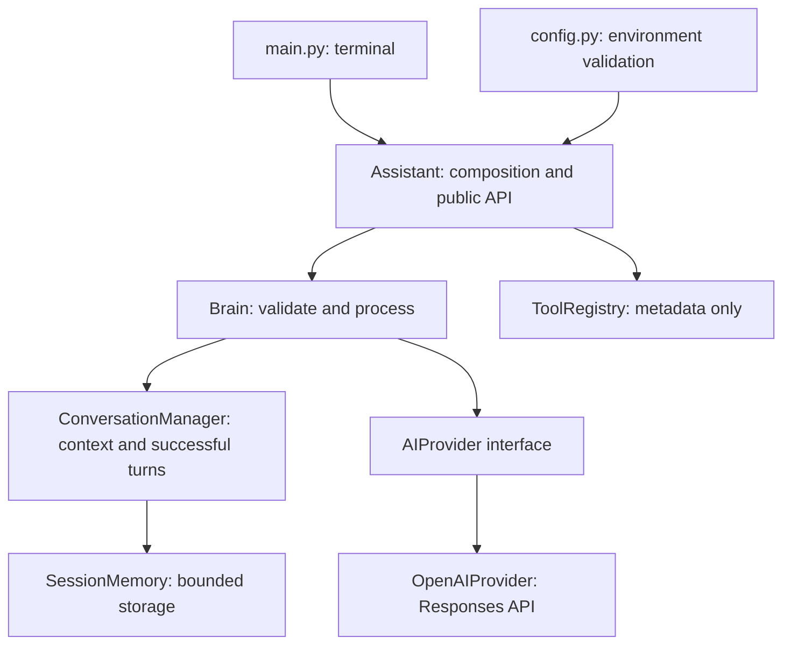

# AVYRA AI V1

AVYRA is a modular personal AI assistant with a professional, friendly, concise conversational identity. V1 delivers terminal chat, follow-up context, and a reusable Python interface. Voice, computer control, vision, persistent memory, and hardware integration are future milestones.

## Features and stack

- Python 3.11+, official OpenAI Python SDK and Responses API.
- Configurable model, defaulting to `gpt-4.1-mini`.
- Bounded session memory, cleared on exit or `/clear`.
- Graceful authentication, quota, connection, timeout, empty-response and incomplete-response errors.
- Dependency injection, pytest and unittest.mock; tests prohibit network connections.
- python-dotenv configuration and lightweight content-free debug events.
- Metadata-only tool registry with explicit permissions and confirmation policy.

## Architecture



See [architecture](docs/architecture.md) for contracts and [roadmap](docs/roadmap.md) for future milestones.

## Windows installation

Install Python 3.11 or newer and Git. In PowerShell, from the opened repository:

```powershell
Set-Location 'C:\Users\aashi\OneDrive\Documents\ChatGPT\AVYRA-AI'
py -3.11 -m venv .venv
.\.venv\Scripts\python.exe -m pip install -r requirements.txt
Copy-Item .env.example .env
notepad .env
.\.venv\Scripts\python.exe main.py
```

Use `py -3.12` or another installed newer version if appropriate. Activation is optional; using the interpreter directly avoids PowerShell execution-policy changes. An existing `.venv` can be used directly. Do not overwrite an existing `.env` when repeating setup.

On macOS/Linux: `python3 -m venv .venv`, `.venv/bin/python -m pip install -r requirements.txt`, copy `.env.example` to `.env`, then `.venv/bin/python main.py`.

## Configuration

Enter your own OpenAI API key in `.env`, or set environment variables. An API account with model access and available quota is required; actual requests may incur charges. The app loads only the `.env` beside `config.py`. Environment variables take precedence.

| Variable | Default | Meaning |
| --- | --- | --- |
| OPENAI_API_KEY | Required | Credential; placeholder values are rejected |
| OPENAI_MODEL | gpt-4.1-mini | Model identifier |
| AVYRA_DEBUG | false | true/false; enables content-free application debug events |
| AVYRA_MAX_HISTORY | 20 | Even message count from 2 through 200 |

Twenty messages means ten complete user/assistant turns. Requests reserve room for the current turn, so at most eighteen previous messages plus the current user message are sent with the default setting. Oldest complete turns are discarded. Failed requests leave history unchanged. Input is limited to 16,000 characters and API output to 2,048 tokens. The SDK timeout is 30 seconds with automatic retries disabled; retry manually after a transient failure.

## Commands

| Command | Action |
| --- | --- |
| /help | Show available commands |
| /clear | Clear current session history |
| /model | Display selected model |
| /status | Display model, stored message count, capacity, memory type and registry count |
| /exit | Exit |

Ctrl+C and end-of-input also exit cleanly. In Windows terminals, EOF may require Ctrl+Z then Enter; terminals that send EOF with Ctrl+D are supported. Blank input and unknown slash commands never call the API. Status describes local state, not a live connectivity check.

## Testing

```powershell
.\.venv\Scripts\python.exe -m pytest -q
```

Tests mock all external API calls and block socket connections; no real key or billable requests are needed. Coverage includes configuration, provider failures and payloads, history boundaries, transactional updates, assistant composition, registry validation and CLI commands/recovery. Passing mocked tests does not establish live account or model availability. To check live integration yourself, configure your credential, run the app, ask a question, then a follow-up.

## Security and privacy

`.env`, virtual environments, caches and logs are ignored by Git. Configuration representations and status omit credentials. The app never logs conversations or raw service exceptions. HTTP/SDK logging is disabled by the CLI even in debug mode. Keep keys out of terminal transcripts and source control. Session messages are held in process memory only, but each request sends the retained context to OpenAI. `store=False` disables Responses application storage; this is not a claim of zero provider retention. See your account's data policies.

V1 has no tool execution, shell commands, filesystem browsing, background services or computer-control access. Future tool metadata does not itself enforce permissions: a future executor must validate permissions and obtain human approval for sensitive actions. The synchronous assistant is intended for one serial conversation per instance; future concurrent frontends must serialize access or use separate instances.

## Git delivery

The requested remote is `https://github.com/YenumulaAashish/AVYRA-AI.git`. At initial inspection its main branch had commit `e0a43e3b7051ee18117b76330c7d255b51228616`, while this opened checkout had no commits. Per the development instructions, do not push over that history. Fetch and review it first, then reconcile deliberately; never force-push. See `docs/delivery.md` for commands.

## Next milestone

V1.1 introduces push-to-talk microphone input, speech-to-text, text-to-speech and playback using the existing assistant interface. No future milestone is implemented in V1.

API contract reference: [OpenAI Responses API](https://developers.openai.com/api/reference/python/resources/responses/methods/create).
