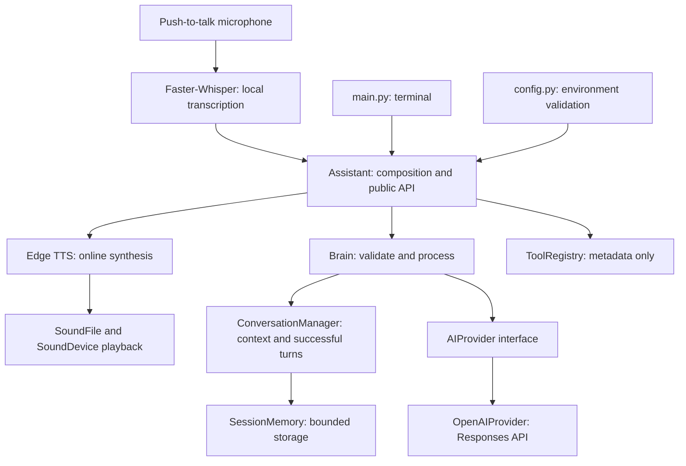

# AVYRA AI V1.1

AVYRA is a modular personal AI assistant with a professional, friendly, concise conversational identity. V1.1 adds explicit push-to-talk voice interaction to terminal chat, follow-up context, and the existing reusable Python interface. Computer control, vision, persistent memory, and hardware integration remain future milestones.

## Features and stack

- Python 3.11+, official OpenAI Python SDK and Responses API.
- Configurable model, defaulting to `gpt-4.1-mini`.
- Bounded session memory, cleared on exit or `/clear`.
- Graceful authentication, quota, connection, timeout, empty-response and incomplete-response errors.
- Dependency injection, pytest and unittest.mock; tests prohibit network connections.
- python-dotenv configuration and lightweight content-free debug events.
- Metadata-only tool registry with explicit permissions and confirmation policy.
- Faster-Whisper local speech recognition and Edge TTS speech output.
- Enter-to-start / Enter-to-stop microphone recording at 16 kHz mono.

## Architecture



See [architecture](docs/architecture.md) for contracts and [roadmap](docs/roadmap.md) for future milestones.

## Windows installation

Install Python 3.11 or newer and Git. In PowerShell, from the opened repository:

```powershell
Set-Location 'C:\Users\aashi\OneDrive\Documents\ChatGPT\AVYRA-AI'
py -3.11 -m venv .venv
.\.venv\Scripts\python.exe -m pip install -r requirements.txt
Copy-Item .env.example .env
notepad .env
.\.venv\Scripts\python.exe main.py
```

Use `py -3.12` or another installed newer version if appropriate. Activation is optional; using the interpreter directly avoids PowerShell execution-policy changes. An existing `.venv` can be used directly. Do not overwrite an existing `.env` when repeating setup.

On macOS/Linux: `python3 -m venv .venv`, `.venv/bin/python -m pip install -r requirements.txt`, copy `.env.example` to `.env`, then `.venv/bin/python main.py`.

## Configuration

Enter your own OpenAI API key in `.env`, or set environment variables. An API account with model access and available quota is required; actual requests may incur charges. The app loads only the `.env` beside `config.py`. Environment variables take precedence.

| Variable | Default | Meaning |
| --- | --- | --- |
| OPENAI_API_KEY | Required | Credential; placeholder values are rejected |
| OPENAI_MODEL | gpt-4.1-mini | Model identifier |
| AVYRA_DEBUG | false | true/false; enables content-free application debug events |
| AVYRA_MAX_HISTORY | 20 | Even message count from 2 through 200 |

Twenty messages means ten complete user/assistant turns. Requests reserve room for the current turn, so at most eighteen previous messages plus the current user message are sent with the default setting. Oldest complete turns are discarded. Failed requests leave history unchanged. Input is limited to 16,000 characters and API output to 2,048 tokens. The SDK timeout is 30 seconds with automatic retries disabled; retry manually after a transient failure.

## Commands

| Command | Action |
| --- | --- |
| /help | Show available commands |
| /clear | Clear current session history |
| /model | Display selected model |
| /status | Display model, stored message count, capacity, memory type and registry count |
| /exit | Exit |

Ctrl+C and end-of-input also exit cleanly. In Windows terminals, EOF may require Ctrl+Z then Enter; terminals that send EOF with Ctrl+D are supported. Blank input and unknown slash commands never call the API. Status describes local state, not a live connectivity check.

## Testing

```powershell
.\.venv\Scripts\python.exe -m pytest -q
```

Tests mock all external API calls and block socket connections; no real key or billable requests are needed. Coverage includes configuration, provider failures and payloads, history boundaries, transactional updates, assistant composition, registry validation and CLI commands/recovery. Passing mocked tests does not establish live account or model availability. To check live integration yourself, configure your credential, run the app, ask a question, then a follow-up.

## Security and privacy

`.env`, virtual environments, caches and logs are ignored by Git. Configuration representations and status omit credentials. The app never logs conversations or raw service exceptions. HTTP/SDK logging is disabled by the CLI even in debug mode. Keep keys out of terminal transcripts and source control. Session messages are held in process memory only, but each request sends the retained context to OpenAI. `store=False` disables Responses application storage; this is not a claim of zero provider retention. See your account's data policies.

V1 has no tool execution, shell commands, filesystem browsing, background services or computer-control access. Future tool metadata does not itself enforce permissions: a future executor must validate permissions and obtain human approval for sensitive actions. The synchronous assistant is intended for one serial conversation per instance; future concurrent frontends must serialize access or use separate instances.

## Git delivery

The requested remote is `https://github.com/YenumulaAashish/AVYRA-AI.git`. At initial inspection its main branch had commit `e0a43e3b7051ee18117b76330c7d255b51228616`, while this opened checkout had no commits. Per the development instructions, do not push over that history. Fetch and review it first, then reconcile deliberately; never force-push. See `docs/delivery.md` for commands.

## Voice installation and launch

From your existing activated or direct-path virtual environment, install the updated requirements:

```powershell
.\.venv\Scripts\python.exe -m pip install -r requirements.txt
.\.venv\Scripts\python.exe main.py --mode text
.\.venv\Scripts\python.exe main.py --mode voice
```

Running without `--mode` preserves text mode. `--help` lists launch options without requiring credentials. Voice mode uses the same Assistant, Brain, OpenAI provider, system instructions and session-memory implementation. Each process has its own session; restarting or changing mode by relaunching does not persist memory.

At `Voice>`, press Enter to start recording, speak, then press Enter again to stop. The microphone closes before local transcription, the text-only AI request and speech playback. You will see your transcript and the assistant reply. Recording stops automatically at 120 seconds; press Enter to continue if that limit is reached. Nothing records while idle or while the assistant speaks. Ctrl+C exits and releases recording/playback resources. `/help`, `/clear`, `/model`, `/status` and `/exit` work at the idle prompt; commands are typed, not spoken. Spoken text goes to the conversational assistant and cannot execute computer actions.

### Microphone and speakers

Select your default microphone and speakers in Windows Settings > System > Sound. Enable microphone access and desktop-app microphone access under Privacy & security > Microphone. Plug in your microphone before launch. List available devices without recording:

```powershell
.\.venv\Scripts\python.exe -m sounddevice
```

The recorder requests float32, 16 kHz, mono audio from the default input device. Playback uses the default output device and the synthesized audio's sample rate. Headphones are useful in shared spaces. The application never opens the microphone on startup; recording requires Enter at the voice prompt. Your existing `experiments/test_whisper.py` is a manual experiment that records immediately when run; pytest is restricted to `tests/` so it never imports that experiment.

### Whisper configuration

Add these settings to your existing `.env`; preserve your existing key and other settings:

```dotenv
AVYRA_STT_MODEL=small
AVYRA_STT_DEVICE=cpu
AVYRA_STT_COMPUTE_TYPE=int8
AVYRA_TTS_VOICE=en-US-AriaNeural
```

The model loads lazily after the first recording and is reused for subsequent turns. The first load may download model files from Hugging Face, requiring internet access and disk space. Later transcription is local using the cached model. `small` supports multilingual speech with automatic language detection; `small.en` is English-only. Choose `tiny`, `base`, `small`, `medium`, or another Faster-Whisper-supported model identifier or local model directory. Paths must not contain whitespace. Larger models use more memory and may be slower on CPU. Device accepts `cpu`, `cuda`, or `auto`; GPU configurations require compatible CTranslate2/CUDA libraries and compute types. CPU/int8 is the tested default configuration path.

### Edge TTS configuration and privacy

`AVYRA_TTS_VOICE` selects an Edge voice, default `en-US-AriaNeural`. Choose a voice suited to the reply language; automatic voice switching is not implemented. List voices (requires internet):

```powershell
.\.venv\Scripts\python.exe -m edge_tts --list-voices
```

Edge TTS uses Microsoft's online service through the third-party `edge-tts` package; no additional API key is configured. AI reply text is sent to that service for synthesis. Microphone audio stays local and is not sent to OpenAI; only the transcript and retained text history are sent through the existing OpenAI provider. Temporary MP3s are created in the OS temporary directory, decoded by SoundFile, and removed after playback, errors, or normal interruption. Force-killing the process or powering off can prevent cleanup. Input recordings are held in memory, not written to disk. Speech synthesis has a 60-second deadline. No extra OpenAI requests are made for speech recognition or synthesis.

### Troubleshooting

- **Microphone unavailable:** enable desktop microphone permissions, select a working default input, close apps holding the device exclusively, and ensure the device supports 16 kHz mono.
- **No speech detected:** record a longer, clearer phrase; check input volume and language/model choice. Silence does not trigger an AI request.
- **Capture overflow:** close heavy applications and record again; incomplete capture is rejected.
- **Model download or recognition failure:** check internet access for the first download, disk space, model identifier and device/compute compatibility. CPU/int8 avoids GPU requirements. Failed model loads may be retried on the next recording.
- **Speech output failed:** check internet access, voice spelling and the default speaker device. The text reply and conversation remain available; continue chatting or restart with `--mode text`.
- **MP3 decoding failure:** install the current requirements; Windows SoundFile wheels bundle libsndfile with MP3 support. On other platforms, PortAudio/libsndfile system packages may also be required.
- **Slow first reply:** model download and CPU inference can take time. Ctrl+C exits; the first model download itself has no application-level timeout.

### V1.1 verification

Automated tests mock microphone streams, model loading/transcription, Edge synthesis, playback and OpenAI responses. They check cleanup, errors, model reuse, history continuity, commands, both launch modes and recording format. They do not activate hardware, download models, contact Edge or make paid API requests. Physical microphone/speaker operation and live end-to-end latency require a manual voice session on your machine.

## Next milestone

Validate a full voice conversation on the target microphone and speakers. V1.2 may then introduce local wake-word detection and microphone state management under a separately approved scope.

API contract reference: [OpenAI Responses API](https://developers.openai.com/api/reference/python/resources/responses/methods/create).
